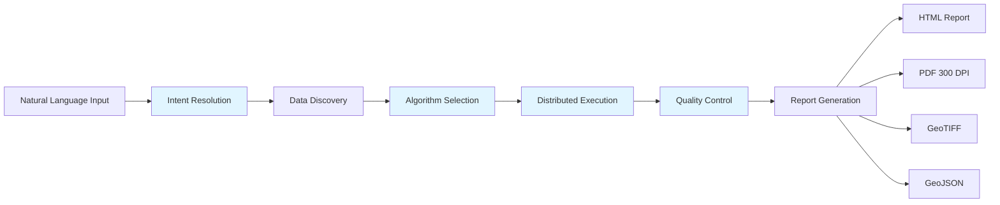
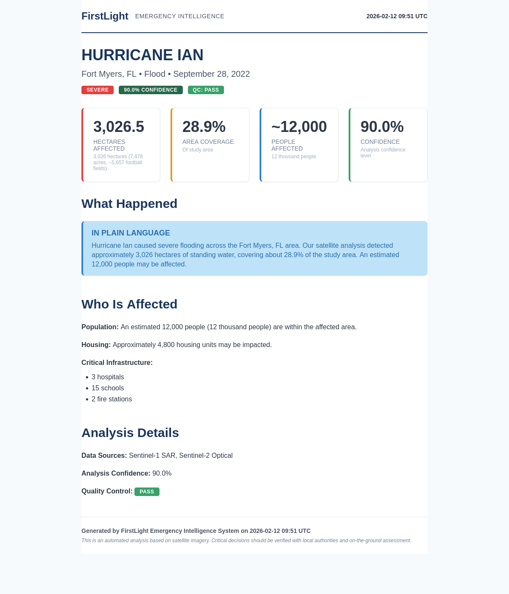
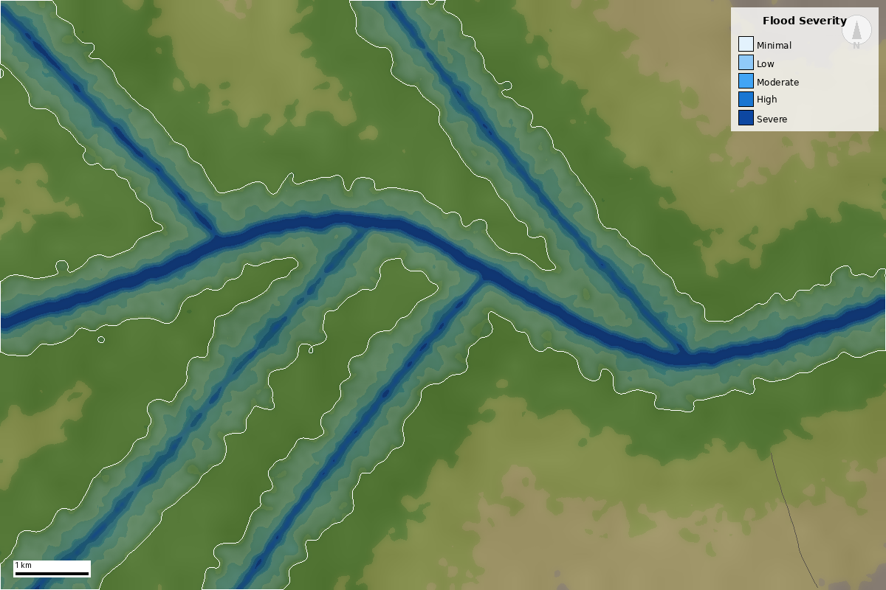
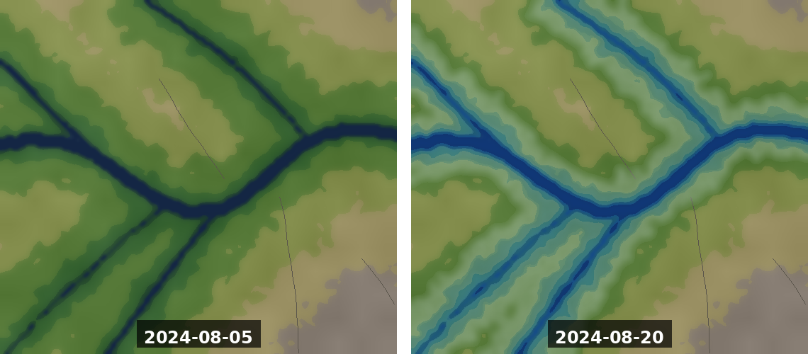

# FirstLight

**Geospatial event intelligence platform that autonomously converts natural language event descriptions into satellite-derived decision products.**




---

## Screenshots

<table>
  <tr>
    <td><br/><em>Executive Summary Report</em></td>
    <td><br/><em>Detection Overlay on Satellite Imagery</em></td>
  </tr>
  <tr>
    <td colspan="2"><br/><em>Before/After Event Comparison</em></td>
  </tr>
</table>

---

## How It Works

### 1. Intent Resolution: Natural Language → Structured Taxonomy

```python
from core.intent import IntentResolver

resolver = IntentResolver()
result = resolver.resolve("flooding in coastal Miami after Hurricane Milton")

# Output:
# result.resolved_class = "flood.coastal.storm_surge"
# result.confidence = 0.92
# result.alternatives = [
#   ("flood.coastal.tidal", 0.67),
#   ("flood.riverine", 0.34)
# ]
```

The system parses natural language, extracts semantic features (location, hazard type, causation), and maps them to a hierarchical event taxonomy with confidence scoring.

### 2. Data Discovery: STAC Search Across Multiple Constellations

```python
from core.data.broker import DataBroker

broker = DataBroker()
datasets = await broker.discover(
    spatial={"type": "Polygon", "coordinates": [...]},
    temporal={"start": "2024-09-15", "end": "2024-09-20"},
    event_class="flood.coastal"
)

# Returns prioritized datasets:
# - Sentinel-1 SAR (cloud-penetrating)
# - Sentinel-2 optical (10m resolution)
# - Copernicus DEM (terrain)
# - ERA5 weather data (storm surge context)
```

### 3. Algorithm Execution: Multi-Sensor Fusion

```python
from core.analysis.library.baseline.flood import ThresholdSARAlgorithm

algorithm = ThresholdSARAlgorithm()
result = algorithm.execute(sar_data, pixel_size_m=10.0)

print(f"Flood area: {result.statistics['flood_area_ha']} hectares")
print(f"Confidence: {result.confidence:.2f}")
print(f"Affected population: {result.statistics['population_exposed']}")
```

### 4. Quality Control: Cross-Validation and Sanity Checks

```python
from core.quality import SanityChecker, CrossValidator

# Sanity checks: geometry validity, plausibility, completeness
checker = SanityChecker()
issues = checker.check(result.flood_extent, event_class="flood.coastal")

# Cross-validation: consensus across multiple algorithms
validator = CrossValidator()
consensus = validator.validate([sar_result, optical_result, change_result])
```

---

## Technical Deep Dives

### 1. Intent Resolution Pipeline

**Challenge:** Event descriptions arrive as unstructured text: "hurricane damage", "flooding after Milton", "wildfires near Sacramento". Need to map these to specific algorithm configurations.

**Solution:** Three-stage pipeline:
1. **NLP Classifier** - TF-IDF + SVM to extract hazard type, location context, causation
2. **Taxonomy Registry** - Hierarchical event classes (`flood.coastal.storm_surge`, `wildfire.forest.crown_fire`) with associated data requirements and algorithms
3. **Resolver Chain** - Matches extracted features to taxonomy, returns confidence-scored alternatives

**Example:**
```
Input: "flooding after hurricane in Miami area"
→ Features: {hazard: flood, location: coastal, causation: storm}
→ Output: flood.coastal.storm_surge (0.92)
         flood.coastal.tidal (0.67)
         flood.riverine (0.34)
```

### 2. Data Engineering Pipeline

**Challenge:** Satellite data arrives in heterogeneous formats across multiple constellations. A single event may require 50+ scenes totaling hundreds of GB. Cannot load everything into memory.

**Solution:** Streaming architecture with:
- **Chunked downloads** - Resume support, parallel fetching across scenes
- **VRT stacking** - Virtual raster datasets combine multi-band data without duplication
- **Band validation** - Pre-flight checks for required spectral bands before processing
- **Memory-mapped access** - Process data in windows, never load full raster

**Performance:**
- Processes terabyte-scale datasets on 8GB laptop via windowed reads
- Validates 20+ spectral bands in <100ms before compute starts
- Resumes interrupted downloads without re-fetching completed chunks

### 3. Distributed Processing Architecture

**Challenge:** Same analysis needs to run on Raspberry Pi (edge deployment) and 100-node Spark cluster (continental monitoring). Cannot maintain separate codebases.

**Solution:** ExecutionRouter pattern with abstraction layer:
```python
class ExecutionRouter:
    def select_backend(self, data_size_mb, available_memory_mb):
        if data_size_mb < 500:
            return SerialExecutor()
        elif available_memory_mb > 8000:
            return DaskExecutor(workers=4)
        else:
            return SparkExecutor(cluster_url)

# Algorithm code is backend-agnostic
router = ExecutionRouter()
executor = router.select_backend(data_size, memory)
result = executor.run(algorithm, data)
```

**Execution profiles** tune chunk size, parallelism, and memory limits:
- `edge` - 1GB RAM, 128px tiles, serial processing
- `laptop` - 2GB RAM, 256px tiles, 2 workers
- `workstation` - 8GB RAM, 512px tiles, 4 workers
- `cloud` - 32GB RAM, 1024px tiles, 16 workers
- `continental` - Spark cluster, dynamic resource allocation

Same algorithm code runs across all profiles.

### 4. Multi-Sensor Fusion Engine

**Challenge:** Different satellites have different resolutions (10m vs 30m), projections (UTM vs geographic), acquisition times (minutes to days apart), and atmospheric conditions. Need consistent output.

**Solution:**
- **Spatial alignment** - Reproject all datasets to common CRS and resolution via GDAL warp
- **Temporal alignment** - Weight contributions by temporal distance from event
- **Atmospheric correction** - Sen2Cor for optical, radiometric calibration for SAR
- **Terrain correction** - Range-Doppler terrain correction using Copernicus DEM
- **Conflict resolution** - When sensors disagree, weight by per-sensor confidence and recency
- **Uncertainty propagation** - Track error from each sensor through fusion to final output

**Example fusion:**
```
Sentinel-1 SAR:  90% flood confidence (cloud-penetrating, day 0)
Sentinel-2 MSI:  75% flood confidence (cloud-obscured, day 2)
Landsat-8 OLI:   85% flood confidence (clear, day 3)

→ Fused consensus: 88% confidence
  Uncertainty: ±12% (propagated from input errors)
```

### 5. API Design

**Challenge:** Support both human-friendly natural language inputs and strict machine interfaces. Track requests across distributed pipeline stages. Handle geometry validation and authentication.

**Solution:** FastAPI with layered validation:

**Intent-Aware Event Submission:**
```python
# Natural language accepted, resolved to structured taxonomy
POST /api/v1/events
{
  "description": "coastal flooding after hurricane Milton",
  "area": {"type": "Polygon", "coordinates": [...]},
  "time_window": {"start": "2024-09-15", "end": "2024-09-20"}
}

# Returns:
{
  "event_id": "evt_abc123",
  "resolved_class": "flood.coastal.storm_surge",
  "confidence": 0.92,
  "status_url": "/api/v1/events/evt_abc123/status"
}
```

**Features:**
- **Pydantic models** - Strict schema validation for all inputs/outputs
- **GeoJSON validation** - Geometry checks via Shapely (valid topology, CRS, bounds)
- **JWT authentication** - Token-based auth with scope-based permissions
- **Rate limiting** - Per-user quotas, tiered by API key level
- **Correlation IDs** - Track requests across pipeline stages (discovery → processing → export)
- **Pagination** - Cursor-based (stateless) and offset-based (stateful) options

**Error handling:**
```python
# Invalid geometry → 422 with specific error
POST /api/v1/events → {"detail": "Invalid polygon: self-intersection at [...]"}

# Authentication required → 401
GET /api/v1/events/evt_abc123 → {"detail": "JWT token required"}

# Rate limit exceeded → 429
POST /api/v1/events → {"detail": "Rate limit exceeded: 100/hour"}
```

---

## Project Metrics

| Metric | Value |
|--------|-------|
| Lines of Code | 170,000+ |
| Test Coverage | 518+ tests |
| Detection Algorithms | 10 (8 baseline + 2 advanced) |
| Data Sources | 6 satellite constellations + DEM + weather |
| Deployment Targets | 10 (Docker, K8s, AWS, GCP, Azure, edge) |
| Supported Event Classes | 25+ hierarchical types |
| API Endpoints | 30+ RESTful routes |
| Processing Backends | 3 (Serial, Dask, Spark) |

---

## Quick Start

### Installation

```bash
# Clone and install
git clone https://github.com/gpriceless/firstlight.git
cd firstlight
pip install -e .

# Install geospatial dependencies
pip install rasterio geopandas xarray pyproj shapely

# Verify installation
flight info
```

### Run Your First Analysis

```bash
# Discover available data for an area
flight discover --area miami.geojson --start 2024-09-15 --end 2024-09-20 --event flood

# Run full analysis pipeline
flight run --area miami.geojson --event flood --profile laptop --output ./results/
```

### Start the API Server

```bash
# Development server
uvicorn api.main:app --host 0.0.0.0 --port 8000 --reload

# API documentation:
# http://localhost:8000/api/docs     (Swagger UI)
# http://localhost:8000/api/redoc    (ReDoc)
```

### Run Tests

```bash
./run_tests.py                    # All tests (518+)
./run_tests.py flood              # Flood tests only
./run_tests.py wildfire           # Wildfire tests
./run_tests.py --algorithm sar    # Specific algorithm
./run_tests.py --list             # Show all categories
```

---

## Supported Hazard Types

| Hazard | Algorithms | Accuracy |
|--------|------------|----------|
| **Flood** | SAR threshold, NDWI optical, change detection, HAND model | 75-92% |
| **Wildfire** | dNBR burn severity, thermal anomaly, burned area classifier | 78-96% |
| **Storm** | Wind damage detection, structural damage assessment | Implemented |

---

## Tech Stack

**Core:** Python 3.12, NumPy, SciPy, rasterio, GDAL, Shapely, GeoPandas
**API:** FastAPI, Pydantic, JWT authentication, Uvicorn
**Processing:** Dask (parallel), Apache Sedona (Spark), STAC
**Reporting:** Jinja2, WeasyPrint (PDF), Folium (maps), Pillow
**Deployment:** Docker, Kubernetes, AWS Lambda/ECS, GCP Cloud Run, Azure Container Instances
**Testing:** pytest (518+ tests), property-based testing, hypothesis
**Data:** Sentinel-1/2, Landsat-8/9, MODIS, Copernicus DEM, SRTM, ERA5

---

## Project Structure

```
firstlight/
├── core/                    # Core processing logic
│   ├── intent/              # Event type classification and resolution
│   ├── data/                # Data discovery, providers, and ingestion
│   ├── analysis/            # Algorithm library and pipeline assembly
│   ├── quality/             # Quality control and validation
│   └── reporting/           # Report generation (HTML, PDF, maps)
├── openspec/                # Specification layer
│   ├── schemas/             # JSON Schema definitions
│   └── definitions/         # YAML event classes, algorithms, data sources
├── agents/                  # Autonomous agent implementations
├── api/                     # FastAPI REST interface
├── cli/                     # Command line interface (flight)
├── deploy/                  # Deployment configurations
│   ├── kubernetes/          # K8s manifests
│   ├── aws/                 # AWS ECS/Lambda configs
│   ├── gcp/                 # GCP Cloud Run configs
│   ├── azure/               # Azure Container Instances / AKS
│   └── edge/                # Edge device configs (Raspberry Pi, Jetson)
├── docker/                  # Dockerfiles (API, CLI, worker)
├── tests/                   # Test suites (518+ tests)
│   ├── unit/                # Unit tests for core modules
│   ├── integration/         # End-to-end pipeline tests
│   ├── e2e/                 # Full pipeline smoke tests
│   └── reporting/           # Report generation tests
├── examples/                # Example event specifications
└── docs/                    # Documentation
    ├── api/                 # API reference
    └── images/              # Screenshots and diagrams
```

---

## License

MIT License

Copyright (c) 2025 FirstLight Project

Permission is hereby granted, free of charge, to any person obtaining a copy
of this software and associated documentation files (the "Software"), to deal
in the Software without restriction, including without limitation the rights
to use, copy, modify, merge, publish, distribute, sublicense, and/or sell
copies of the Software, and to permit persons to whom the Software is
furnished to do so, subject to the following conditions:

The above copyright notice and this permission notice shall be included in all
copies or substantial portions of the Software.

THE SOFTWARE IS PROVIDED "AS IS", WITHOUT WARRANTY OF ANY KIND, EXPRESS OR
IMPLIED, INCLUDING BUT NOT LIMITED TO THE WARRANTIES OF MERCHANTABILITY,
FITNESS FOR A PARTICULAR PURPOSE AND NONINFRINGEMENT. IN NO EVENT SHALL THE
AUTHORS OR COPYRIGHT HOLDERS BE LIABLE FOR ANY CLAIM, DAMAGES OR OTHER
LIABILITY, WHETHER IN AN ACTION OF CONTRACT, TORT OR OTHERWISE, ARISING FROM,
OUT OF OR IN CONNECTION WITH THE SOFTWARE OR THE USE OR OTHER DEALINGS IN THE
SOFTWARE.
